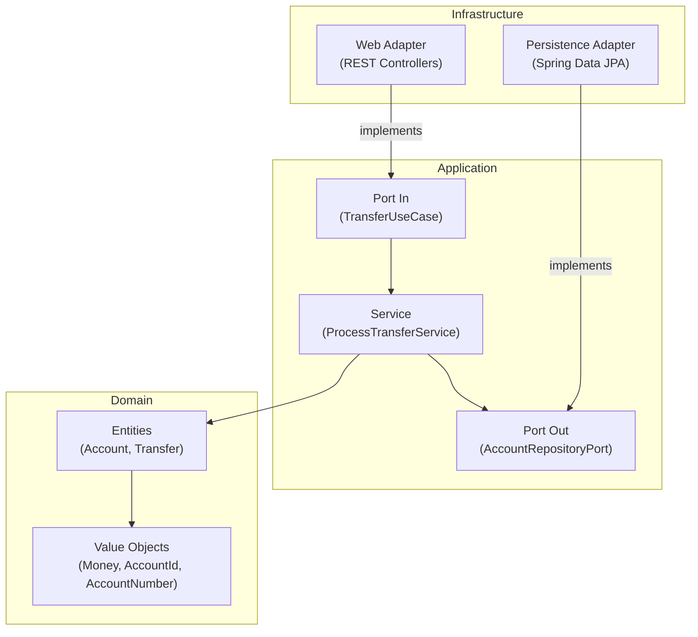

# Bank Transfer Core 🏦

   

A REST API for processing internal bank transfers, built with **Hexagonal Architecture**, immutable **Value Objects**, and financial-grade precision using `BigDecimal`. Demonstrates Domain-Driven Design, automated architectural enforcement with ArchUnit, and modern Java 21 practices.

## 🚀 Tech Stack

| Category       | Technology                                     |
|----------------|------------------------------------------------|
| Language       | Java 21                                        |
| Framework      | Spring Boot 3.3                                |
| Architecture   | Hexagonal (Ports & Adapters)                   |
| Build          | Maven                                          |
| Database       | PostgreSQL                                     |
| Testing        | JUnit 5 + AssertJ + Mockito (BDD) + ArchUnit   |
| Code Style     | Spotless + Google Java Format                  |

## 🏛️ Hexagonal Architecture



### ArchUnit Enforcement

Dependency rules are automatically validated via ArchUnit tests:

- Domain **cannot depend** on Infrastructure or Spring Framework.
- Application **cannot depend** on Spring Framework.
- Any violation breaks the build.

## 📂 Project Structure

```
src/main/java/com/portfolio/banktransfercore/
├── domain/                          # Pure Java — no framework dependencies
│   ├── account/                     # Account, AccountId, AccountNumber
│   ├── transfer/                    # Transfer, TransferId
│   └── shared/money/               # Money, SupportedCurrency
├── application/                     # Use cases and port interfaces
│   ├── ports/in/                    # TransferUseCase
│   ├── ports/out/                   # AccountRepositoryPort
│   └── services/                   # ProcessTransferService
└── infrastructure/                  # Spring adapters
    ├── web/                         # TransferController, TransferRequest
    └── config/                      # ApplicationConfig
```

## ⚙️ Getting Started

### Prerequisites
- Java 21+
- Maven 3.9+

### Run
```bash
git clone https://github.com/rcpc265/banktransfercore.git
cd banktransfercore
./mvnw clean compile test
```

## 🗺️ Engineering Roadmap

### Phase 1: Core Domain & Operational Skeleton ✅
* Domain entities with rich Value Objects and construction-time validation.
* Automated DDL via Hibernate for rapid prototyping.
* Architectural boundary enforcement with ArchUnit.

### Phase 2: Enterprise Persistence & Defensive Locking (In Progress)
* Flyway Migrations replacing automated DDL.
* Pessimistic Locking (`@Lock`) for concurrent transfer safety.
* Global exception handling via `@RestControllerAdvice`.

### Phase 3: High Availability & QA Verification (Planned)
* Idempotency layer for safe network retries.
* Integration testing coverage expansion.
* Load testing with Apache JMeter.